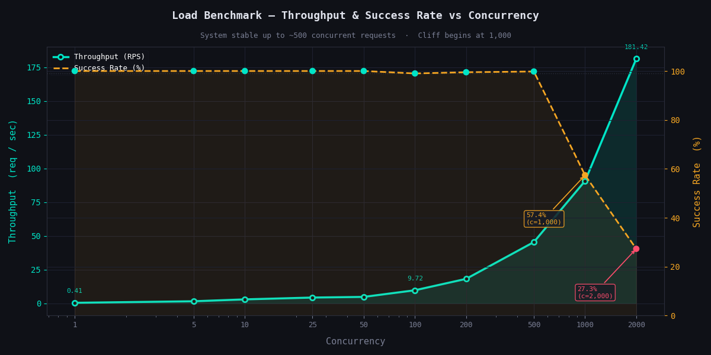
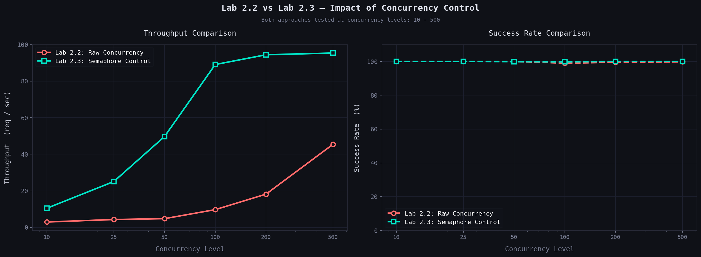

# Week 2 - AsyncIO Deep Dive - Internals + Production Practices

## Lab 2.1: Event Loop Deep Dive

**Question:**
Is AsyncIO single-threaded or multi-threaded? Is it parallel or concurrent? Why does async/await exist?

**Hypothesis:**
As of my theoretical knowledge, asyncio is praimarily for utilizing the time that is otherwise wasted during I/O operations. and it may come out as 'fast' but it is not actually, it just uses time more efiiciently and it is concurrent but not parallel.

**Experiment:**
- Created 10 async tasks
- Each prints threading.current_thread()
- Used asyncio.gather() to run concurrently
- Used eventloop-blocking funtions like time.sleep() to prove that they should be never used in async code as they block the event loop. It also proves that asyncio is single-threaded. 

**Results:**
| Task ID | Thread Name | 
|---------|-------------|
| 0-9     | MainThread  |

**Explanation:**
- from the very first experiment we proved that asyncio is single-threaded, by printing the thread used by each task, and each task used the same thread, even when running concurrently. This proves single threading and concurrency both at the same time.
when we hit await, it acts as yield, and pauses, and gives conrol back to event loop, so it can continue running other tasks and does not wait or block. It is greatly differentiable when we are dealing with input output tasks, or fetching urls, or doing something that causes the event loop to wait for something. The event loop knows about which tasks are ready to run using epoll, select, kqueue, etc. Deep under the hood, OS timer comes into play to wake up the event loop when it is time to run the next task.

**Real-World Impact:**
In production, this means 1,000 embedding requests won't create 1,000 threads. 
They'll all execute on ONE thread, switching during I/O waits. This would greatly improve the speed and efficiency of the application.

## Lab 2.2: Concurrency Trap

**Question:**
What is the concurrency trap? Does increasing concurrency always improve performance?

**Hypothesis:** Intuitively, it should, because it makes logical sense. But considering factors like overhead, client-server interaction, server capacity, it needs to be tested.

**Experiment:**
- Created a benchmark function that measures throughput, response time, and success rate for different levels of concurrency (1, 5, 10, 25, 50, 100, 200, 500, 1000, 2000).
- Used aiohttp to fetch a dummy URL and measure response time.
- Used asyncio to run the benchmark concurrently.
- Plotted the results using matplotlib.

**Results:**

| Concurrency | Throughput (req/s) | Response Time (s) | Success Count | Success Rate (%) |
|:------------|:-------------------|:------------------|:--------------|:-----------------|
| 1           | 0.41               | 2.47              | 1             | 100.0%           |
| 5           | 1.56               | 3.20              | 5             | 100.0%           |
| 10          | 2.95               | 3.39              | 10            | 100.0%           |
| 25          | 4.31               | 5.80              | 25            | 100.0%           |
| 50          | 4.79               | 10.44             | 50            | 100.0%           |
| 100         | 9.72               | 10.29             | 99            | 99.0%            |
| 200         | 18.18              | 11.00             | 199           | 99.5%            |
| 500         | 45.46              | 11.00             | 499           | 99.8%            |
| 1000        | 90.82              | 11.01             | 574           | 57.4%            |
| 2000        | 181.42             | 11.02             | 546           | 27.3%            |

**Explanation:**

- Here comes the little's law : Concurrency = Throughput * Response Time
- As concurrency increases beyond the sweet spot, success rate drops, making the higher throughput meaningless.
- One more critical insight is that, success rate more important than throughput. 
- Server overload is a real-world issue, due to which, we cannot increase concurrency linearly.

**Errors I faced:**

- accidentally overwrote the response object with the JSON data (e.g., response = await response.json()). I realized I was throwing away the object with .status, which made it impossible to check if the request actually succeeded.

- tried to await asyncio.gather(*tasks) outside the async with block. The code failed, I learned the session must stay open while tasks are active.

**Real-World Impact:**

- In our RAG platform, while making api calls for embeddings and context, using high concurrency would lead to server overload and dropped packets. We must prioritize success rate over throughput.

---

## Lab 2.3: Controlled Concurrency

**Question:**  
How does limiting concurrency come in action, why do we use semaphores, how does it limit concurrency?

**Hypothesis:**  
I expect that limiting concurrency using semaphores will improve the success rate and response time, because it will prevent the server from being overloaded.

**Experiment:**
- Implemented rate limiting using semaphore to limit the concurrency.
- Used semaphore to limit the concurrency to 10, 25, 50, 100, 200, 500, 1000, 2000.
- Variables: Semaphores ([10, 25, 50, 100, 200, 500])

**Results:**

| Semaphore Limit | Time (s) | Throughput (req/s) | Success Rate |
|-----------------|----------|--------------------|--------------|
| 10              | 95.49    | 10.47              | 100.0%       |
| 25              | 39.84    | 25.10              | 100.0%       |
| 50              | 20.11    | 49.73              | 99.9%        |
| 100             | 11.22    | 89.10              | 99.8%        |
| 200             | 10.59    | 94.44              | 100.0%       |
| 500             | 10.48    | 95.39              | 100.0%       |

**Key Findings:**

 The semaphore approach greatly increases the consistency and success rate, it even makes us able to get 100% success rate on 500 as semphore value, and using 1000 as concurrency limit.

**Explanation:**

Rate limiting is one of the best practices to prevent server overloadp and possible program crashes. Using semaphore is one of the ways to implement rate limiting. It works by limiting the number of tasks that can run concurrently.

**Errors I faced:**

- *Bug:* i used semaphore creation inside the fetching function, which killed the concurrency → *Learned:* always create semaphore outside the fetching function and open session with semaphore, inside make as many concurrent calls, but you would be limited by the semaphore value.

**Real-World Impact:**

- In our RAG platform, while making api calls for embeddings and context, rate limiting would be one of the best practices to prevent server overload and possible program crashes. if I call openAI embedding api without any rate limiting, i may face broken responses, which would definitely affect the quality of embeddings, and overall performance of the RAG system.

## Comparison: Lab 2.2 vs Lab 2.3

**Lab 2.2 (Unlimited Concurrency) vs Lab 2.3 (Semaphore-Controlled Concurrency)**

| Metric | Lab 2.2 (Concurrency: 1000) | Lab 2.3 (Semaphore: 500, Total: 1000) |
|--------|----------------------------|---------------------------------------|
| Throughput | 90.82 req/s | 95.39 req/s |
| Success Rate | **57.4%** | **100.0%** |
| Response Time | 11.01s | 10.48s |

**Key Insights:**

Without rate limiting (Lab 2.2), pushing 1000 concurrent requests resulted in only 57.4% success rate and degraded further to 27.3% at 2000 concurrency. The server became overloaded and started rejecting requests.

With semaphore-based rate limiting (Lab 2.3), we achieved 100% success rate while processing the same 1000 requests. By limiting concurrency to 500, we actually got *better* throughput (95.39 vs 90.82 req/s) and *faster* response times (10.48s vs 11.01s).

**Conclusion:** Controlled concurrency through semaphores prevents server overload, leading to higher success rates, better throughput, and more predictable performance. The trade-off of slightly limiting parallelism is far outweighed by the gains in reliability and consistency.
---