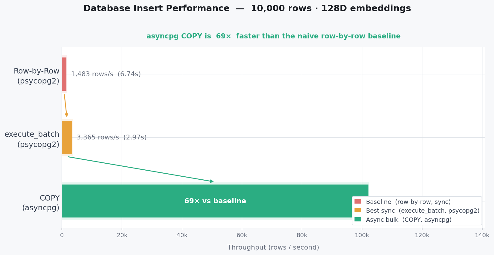

# Week 3 - PostgreSQL + pgvector - From Slow Inserts to Production Pipeline

## Lab 3.1: Database Setup

**Question:**
How do you set up PostgreSQL with pgvector extension for storing embeddings?

**What I Did:**
- Spun up PostgreSQL via Docker using `pgvector/pgvector:pg16` image
- Connected using both `psycopg2` (sync) and `asyncpg` (async) to understand the difference
- Registered pgvector extension with `CREATE EXTENSION IF NOT EXISTS vector`
- Defined schema with `VECTOR(768)` column type for embedding storage

**Key Insight:**
pgvector is not built into PostgreSQL — it's an extension you load per database. And in asyncpg, you also have to register it per connection using `register_vector(conn)`, otherwise asyncpg doesn't know how to serialize Python lists into the `vector` type.

---

## Lab 3.2: Baseline INSERT Benchmarks

**Question:**
How slow is row-by-row INSERT for bulk embedding storage?

**Hypothesis:**
Individual inserts will be slow because each one is a separate round trip to the database.

**Experiment:**
- Inserted 10,000 rows with 128-dim embeddings using `psycopg2`
- Measured three approaches: individual INSERT, executemany, execute_batch
- Recorded time and throughput

**Results:**

| Approach | Time (s) | Throughput (rows/s) | Speedup |
|----------|----------|---------------------|---------|
| Individual INSERT | 6.74s | 1,483 rows/s | 1x |
| executemany | 6.54s | 1,529 rows/s | 1.03x |
| execute_batch (page_size=1000) | 2.97s | 3,365 rows/s | 2.27x |

**Explanation:**
Every individual INSERT is a full round trip — send query, PostgreSQL parses it, executes it, sends back confirmation. Do this 10,000 times and you're paying that overhead 10,000 times. `executemany` is essentially a lie — it just loops `execute()` internally, confirmed by the near-identical timing (1.03x). `execute_batch` is the first real improvement, batching multiple rows per round-trip.

**Real-World Impact:**
Even the best psycopg2 approach (3,365 rows/s) is far too slow for production embedding storage. This sets up the motivation for asyncpg COPY in Lab 3.3.

---

## Lab 3.3: COPY Command - Bulk Insert

**Question:**
How much faster is PostgreSQL's COPY command compared to individual INSERTs?

**Hypothesis:**
COPY should be significantly faster because it bypasses the query parser and sends raw data in a single stream.

**Experiment:**
- Switched from `psycopg2` to `asyncpg` for async support
- Used `copy_records_to_table()` to bulk insert same 10,000 rows
- Compared against Lab 3.2 baseline

**Results:**

| Approach | Time (s) | Throughput (rows/s) | Speedup |
|----------|----------|---------------------|---------|
| asyncpg row-by-row | 22.11s | 452 rows/s | baseline |
| psycopg2 execute_batch (best sync) | 2.97s | 3,365 rows/s | 2.3x |
| asyncpg COPY | 0.098s | 102,106 rows/s | **226x** |



**Explanation:**
COPY is PostgreSQL's bulk load mechanism. Instead of parsing SQL for each row, it opens a binary stream directly into the table. No per-row overhead, no query parsing, no round-trip confirmation per row. The entire dataset lands in one operation.

`copy_records_to_table()` takes a list of tuples — each tuple maps to one row, in the exact column order you specify. The `register_vector(conn)` call is what makes asyncpg understand how to serialize the Python list into a `vector` type before sending.

Interesting observation: asyncpg row-by-row (22.1s) is actually much *slower* than psycopg2 row-by-row (6.7s). This is because each `await conn.execute()` has async overhead on top of the round trip. But asyncpg's COPY completely erases that — the protocol-level bulk loading wins regardless.

**Errors I faced:**
- Forgot to call `register_vector(conn)` — got a serialization error because asyncpg didn't know the `vector` type. Fixed by registering it immediately after connecting.
- Forgot `await` on `register_vector(conn)` — it's an async function that needs to be awaited.

**Real-World Impact:**
226x speedup means what took 22 seconds now takes 0.098 seconds. At 102K rows/s, we can store a million embeddings in under 10 seconds. COPY is the only acceptable approach for bulk embedding storage.

---

## Lab 3.4: Connection Pooling

**Question:**
How much overhead does opening and closing a database connection per batch add, and does a connection pool eliminate it?

**Hypothesis:**
Each connect/close cycle has TCP handshake + PostgreSQL auth overhead. A pool should eliminate this by keeping connections alive and reusing them.

**Experiment:**
- Inserted 10,000 vectors in 10 batches of 1,000 using three approaches
- Approach 1: fresh `asyncpg.connect()` per batch — full overhead each time
- Approach 2: pool, sequential — borrow/return one batch at a time
- Approach 3: pool, concurrent — all 10 batches via `asyncio.gather()` simultaneously

**Results:**

| Approach | Time (s) | Speedup |
|----------|----------|----------|
| No pool (fresh connect per batch) | 0.991s | 1x |
| Pool sequential | 0.700s | 1.4x |
| Pool concurrent | 0.630s | 1.6x |


**Explanation:**

**No pool:** Every batch pays 5-20ms for TCP handshake + PostgreSQL auth + pgvector registration. 10 batches = 10 full cycles. Pure overhead.

**Pool sequential:** `asyncpg.create_pool()` creates connections at startup with `min_size`. Each batch borrows an already-alive connection using `async with pool.acquire()`, does the COPY, returns it. The TCP handshake happened once at startup — never again.

**Pool concurrent:** Same pool, but `asyncio.gather()` fires all 10 batch coroutines simultaneously. Each coroutine acquires its own connection from the pool. If all connections are busy, extra coroutines wait — they don't crash, the pool queues them. This is where `max_size` matters: it's the ceiling on simultaneous connections.

One important quirk — with a pool, you don't control when connections are created internally. So you pass `init=register_vector` to `create_pool()`. The pool calls this callback on every new connection it creates, so pgvector is always registered without you managing it manually.

**Errors I faced:**
- Called `await` at module level outside an async function — Python doesn't allow this. Everything has to live inside `async def main()`.
- Put `sys.path.insert()` after the import that needed it — Python fails on the import before reaching the path fix. Path setup must always come before any imports that depend on it.

**Real-World Impact:**
In a pipeline processing 100K chunks in batches of 1,000, that's 100 connect/destroy cycles without a pool. Each cycle is 5-20ms wasted. Pool eliminates all of it. Combined with COPY from Lab 3.3, the database layer is no longer a bottleneck.

---

## Integration: Full Pipeline (db_ingest.py)

**What I Built:**
Rewrote `async_ingest.py` as `db_ingest.py` — same pipeline structure, but replaced HTTP embedding API calls and JSONL file writing with local `embed_chunks()` and direct database inserts via COPY.

**New pipeline flow:**
```
read_chunks()       → generator of raw text chunks
clean_chunks()      → generator of cleaned chunks  
batch_generator()   → lists of 50 chunks at a time
embed_chunks()      → list of (chunk, embedding) tuples per batch
pool.acquire()      → borrow live connection from pool
bulk_insert()       → COPY batch into documents table
                    → return connection to pool, repeat
```

**What each file in `core/database/` does:**

- `schema.sql` — run once manually, creates the `documents` table. Never touched by the pipeline itself.
- `pool.py` — called once at pipeline startup, creates the pool with `init=register_vector`.
- `bulk_ops.py` — one function, `bulk_insert(conn, batch)`. Receives an open connection and a batch of `(chunk, embedding)` tuples, fires `copy_records_to_table`. Zero imports needed — conn comes in from outside.

**Integration test result:**
```
Total chunks:  1024
Total time:    0.789s
Throughput:    1297.33 chunks/sec
Rows in database: 1024
Match: True
```

**The full Week 1-3 story:**

- Week 1 generators → memory stays flat regardless of file size
- Week 2 semaphores → controlled concurrency, 100% API success rate
- Week 3 COPY + pooling → fast DB writes, zero connection overhead

The pipeline can now process large files without memory issues, without API failures, and without DB bottlenecks. Each week solved one layer of the problem.